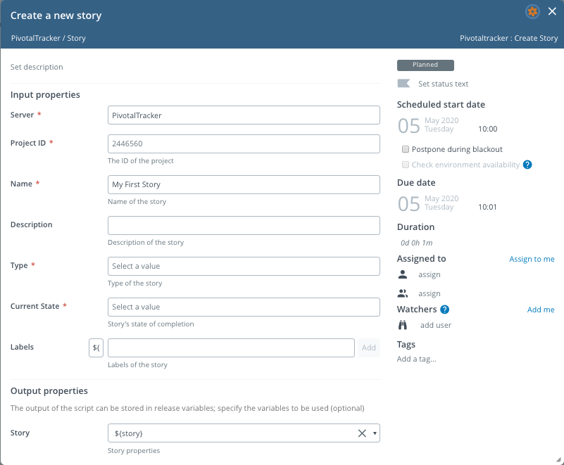
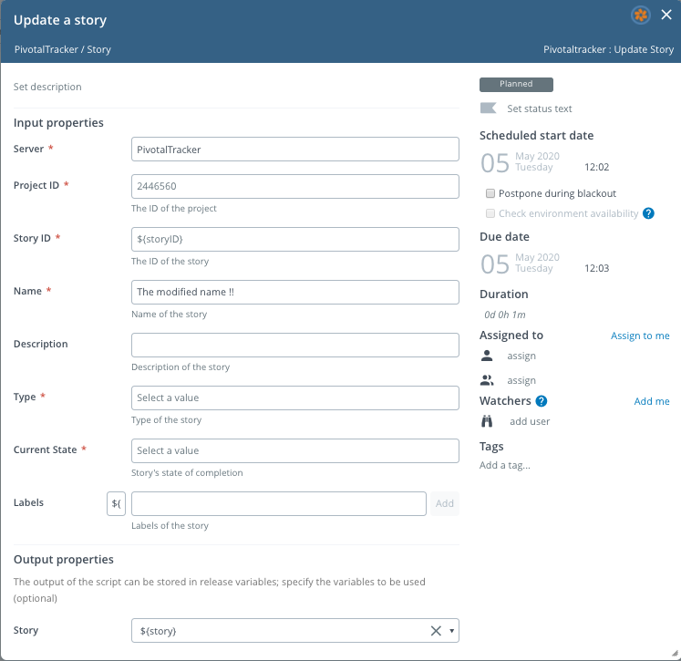
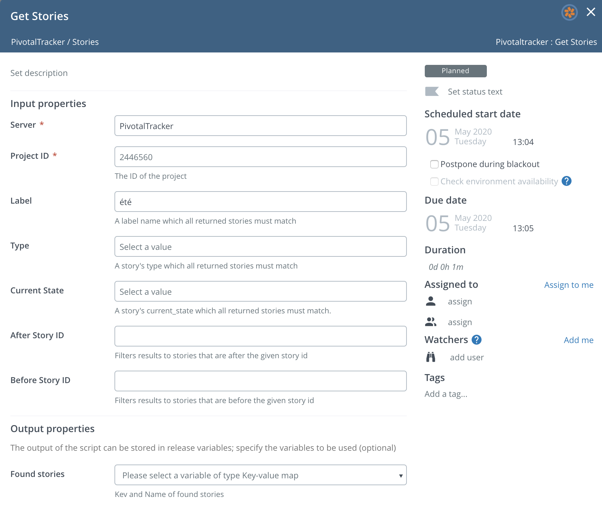
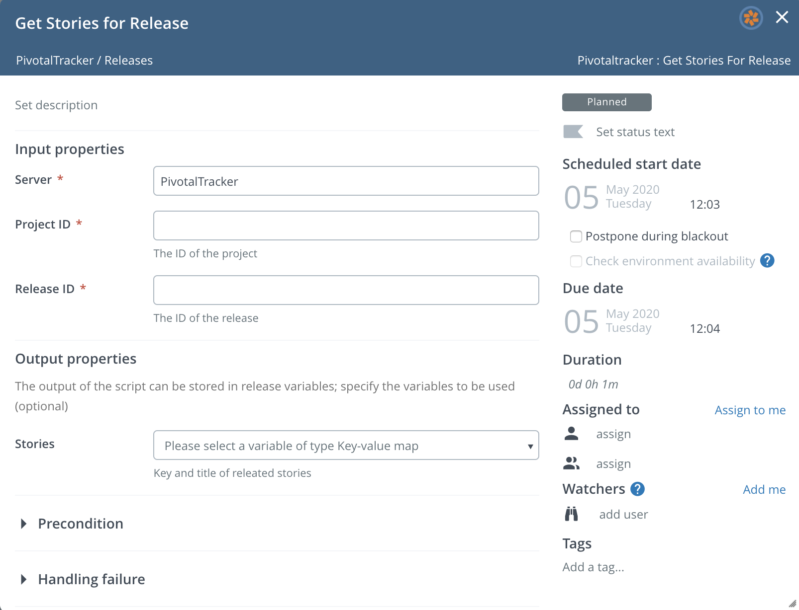
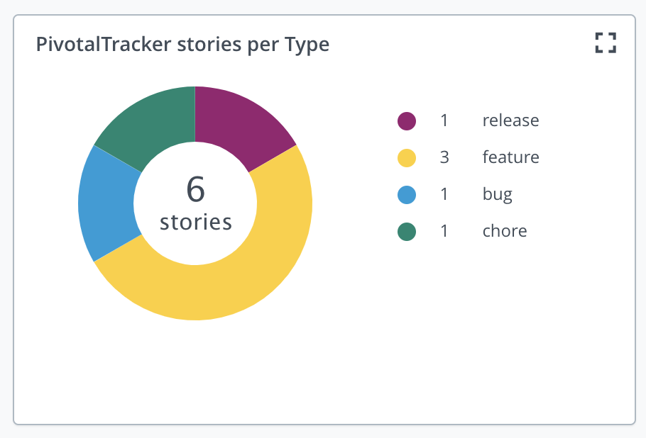
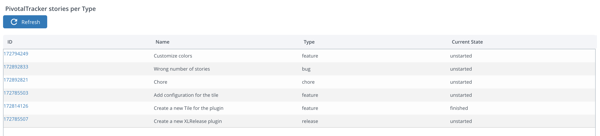

# XL Release PivotalTracker plugin

[![Build Status][xlr-pivotaltracker-plugin-travis-image]][xlr-pivotaltracker-plugin-travis-url]
[![License: MIT][xlr-pivotaltracker-plugin-license-image]][xlr-pivotaltracker-plugin-license-url]
![Github All Releases][xlr-pivotaltracker-plugin-downloads-image]

[xlr-pivotaltracker-plugin-travis-image]: https://travis-ci.org/xebialabs-community/xlr-pivotaltracker-plugin.svg?branch=master
[xlr-pivotaltracker-plugin-travis-url]: https://travis-ci.org/xebialabs-community/xlr-pivotaltracker-plugin
[xlr-pivotaltracker-plugin-license-image]: https://img.shields.io/badge/License-MIT-yellow.svg
[xlr-pivotaltracker-plugin-license-url]: https://opensource.org/licenses/MIT
[xlr-pivotaltracker-plugin-downloads-image]: https://img.shields.io/github/downloads/xebialabs-community/xlr-pivotaltracker-plugin/total.svg

## Preface

This document describes the functionality provided by the XL Release PivotalTracker plugin.

See the [XL Release reference manual](https://docs.xebialabs.com/xl-release) for background information on XL Release and release automation concepts.  

## Overview

The xlr-pivotaltracker-plugin is an XL Release to integrate with PivotalTracker server.

## Requirements

Note:  XLR version should not be lower than lowest supported version.  See <https://support.xebialabs.com/hc/en-us/articles/115003299946-Supported-XebiaLabs-product-versions>.

## Installation

* Copy the latest JAR file from the [releases page](https://github.com/xebialabs-community/xlr-pivotaltracker-plugin/releases) into the `RELEASE_SERVER/plugins` directory.
* Restart the XL Release server.

## Usage

### Create Story Task

### Update Story Task

### Get Stories Task

### Get Stories for Release Task

### Summary for tile 'PivotalTracker: List of stories'

### Details for tile 'PivotalTracker: List of stories'

## References

* [Pivotal Tracker API](https://www.pivotaltracker.com/help/api/rest/v5#top)

## History

|  Version |  Date | Description  |
|---|---|---|
|  0.1.0 | May 7, 2020  | Initial version (for demo purpose)  |
|  0.2.0 | May 13, 2020  | Added 'Get Stories' and 'Get Stories for Release' tasks  |
|  0.3.0 | May 20, 2020  | Added the tile 'PivotalTracker: List of stories'  |
|  0.4.0 | May 29, 2020  | Added support to contribute data to the Release Audit Report  |
|  0.4.1 | May 29, 2020  | README update  |